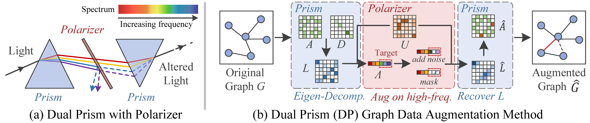
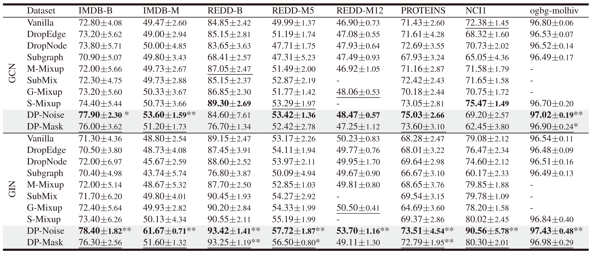

# Through The Dual-Prism: A Spectral Perspective On Graph Data Augmentation For Graph Classification

*Spectral Space Graph Augmentation Method*

This repo provides the implementation code corresponding to our AAAI-25 paper entitled *Through The Dual-Prism: A Spectral Perspective On Graph Data Augmentation For Graph Classification*.

[[Paper](https://arxiv.org/pdf/2401.09953)]

TL;DR - DP method is a graph data augmentation in spectral space, consisting of two steps, analogous to light passing through a prism twice. First, the graph is transformed into the spectral space. After altering the eigenvalues, the graph is reconstructed from the spectral space. We observe that simply adding noise or masking the eigenvalues in the spectral space can effectively achieve data augmentation.


The results on supervised learning setting are shown below. The best and second best results are highlighted with bold and underline, respectively. * and ** denote the improvement over the second best baseline is statistically significant at level 0.1 and 0.05.



## Requirements
Our code is tested with CUDA 12.4. Experiment environment can be built from the `yml` file.
```sh
cd "path/to/this/folder"
conda env create -f environment.yml
```

## Run
To run the code using the following commands. 
```sh
cd src

python main.py \
    --dataset IMDB-BINARY \
    --model GIN \
    --spectral_aug noise \  # Augmentation type: mask or noise
    --freq high \  # Portion of eigenvalues to be augmented: high or low
    --aug_ratio 0.2 \  # Proportion of eigenvalues to be influenced. Number of influenced eigenvalues = Number of nodes * aug_ratio
    --freq_ratio 0.5 \  # Probability with which the eigenvalues will be changed
    --std_dev 0.1  # Standard deviation of the added noise
```

## Run with DIG Package
We have also integrated our method into the [DIG pacakge](https://github.com/divelab/DIG) v1.0.0. The added code can be found in the `DIG` folder. Please refer to the DIG package for setting up the environment. You can use the following code to run our method. 

## Citation

If you find our work useful in your research, please cite:
```bibtex
@inproceedings{dualprism,
      title={Through the Dual-Prism: A Spectral Perspective on Graph Data Augmentation for Graph Classification}, 
      author={Yutong Xia and Runpeng Yu and Yuxuan Liang and Xavier Bresson and Xinchao Wang and Roger Zimmermann},
      year={2024},
      booktitle = {Proceedings of the AAAI Conference on Artificial Intelligence}
}
```

## Code Reference

- [gmixup](https://github.com/ahxt/g-mixup): We would like to thank the author for their nice work and codebase.
